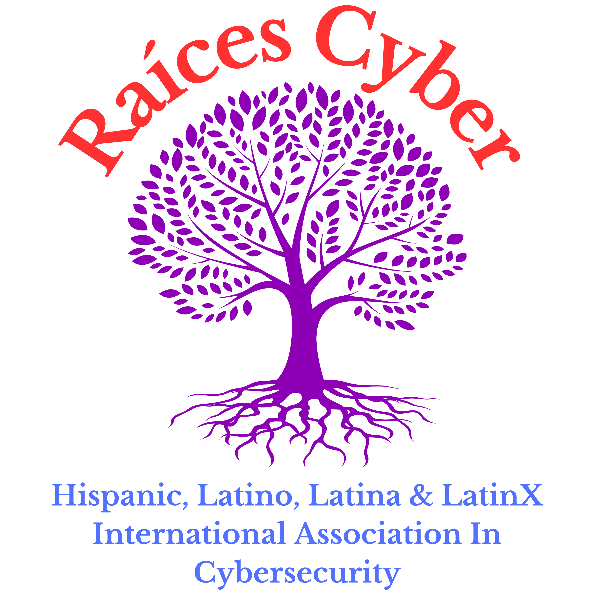

# Raices Cyber Org CTF


[Raices Cyber Links](https://bio.link/raicescy)

Raices Cyber CTF is an open source platform made by the team .
GZ::CTF is an open source CTF platform based on ASP.NET Core.
Thanks to the developers over at GZCTF for making the platform.


> [!IMPORTANT]
> **To save your effort, please read the documentation carefully before using: [https://docs.ctf.gzti.me/en](https://docs.ctf.gzti.me/en)**

> [!WARNING]
> Since 01/01/2024, the database structure of the `develop` image is no longer compatible with previous versions. If you prefer to use it, please go to `v0.17`.
>
> During the rapid development of new features, it is not recommended to use the `develop` image for production deployment, and the database structure changes will cause data loss.

## Features 🛠️

- Create highly customizable challenges

  - Type of challenges: Static Attachment, Dynamic Attachment, Static Container, Dynamic Container
    - Static Attachment: Shared attachments, any configured flag can be accepted.
    - Dynamic Attachment: The number of flags and attachments must be at least the number of teams. Attachments and flags are distributed according to the teams.
    - Static Container: Shared container templates, no dynamic flag is issued, and any configured flag can be submitted.
    - Dynamic Container: Automatically generate and issue flags through container environment variables, and flag of each team is unique.

  - Dynamic Scores

    - Curve of scores:

      $$f(S, r, d, x) = \left \lfloor S \times \left[r  + ( 1- r) \times \exp\left( \dfrac{1 - x}{d} \right) \right] \right \rfloor $$

      Where $S$ is the original score, $r$ is the minimum score ratio, $d$ is the difficulty coefficient, and $x$ is the number of submissions. The first three parameters can be customized to satisfy most of the dynamic score requirements.

    - Bonus for first three solves:
      The platform rewards 5%, 3%, and 1% of the current score for the first three solves respectively.

  - Disable or enable challenges during the competition, and release new challenges at any time.
  - Dynamic flag sharing detection, optional flag template, leet flag


- **Teams** score timeline, scoreboard. Teams can be grouped
- Dynamic container distribution, management, and multiple port mapping methods based on **Docker or K8s**
- **Real-time** competition notification, competition events and flag submission monitoring, and log monitoring based on SignalR
- SMTP email verification, malicious registration protection based on Google ReCaptchav3
- Ban specific user, three-level user permission management
- Optional team review, invitation code, registration email restriction
- Writeup collection, review, and batch download in the platform
- Download exported scoreboard, export all submission records
- Monitor submissions and major event logs during the competition
- Challenges traffic forwarding based on **TCP over WebSocket proxy**, configurable traffic capture
- Cluster cache based on Redis, database storage backend based on PGSQL
- Customizable global configuration, platform title, record information
- And more...

## Demo 🗿


## Deployment Notes

To deploy this project locally you need to build the `gzctf:raices` docker image. Run the following commands to do it:

```shell
git clone https://github.com/Raices-Cyber-Org/GZCTF-RaicesCyberOrg.git
cd GZCTF-RaicesCyberOrg/src/
# Make sure the pinned docker-compose.yml and appsettings.json are present in the folder
docker image build -t gzctf:raices .
docker compose up -d
# Visit http://localhost
```

## More Information

For more information about the platform, head over to the Original Repository.


